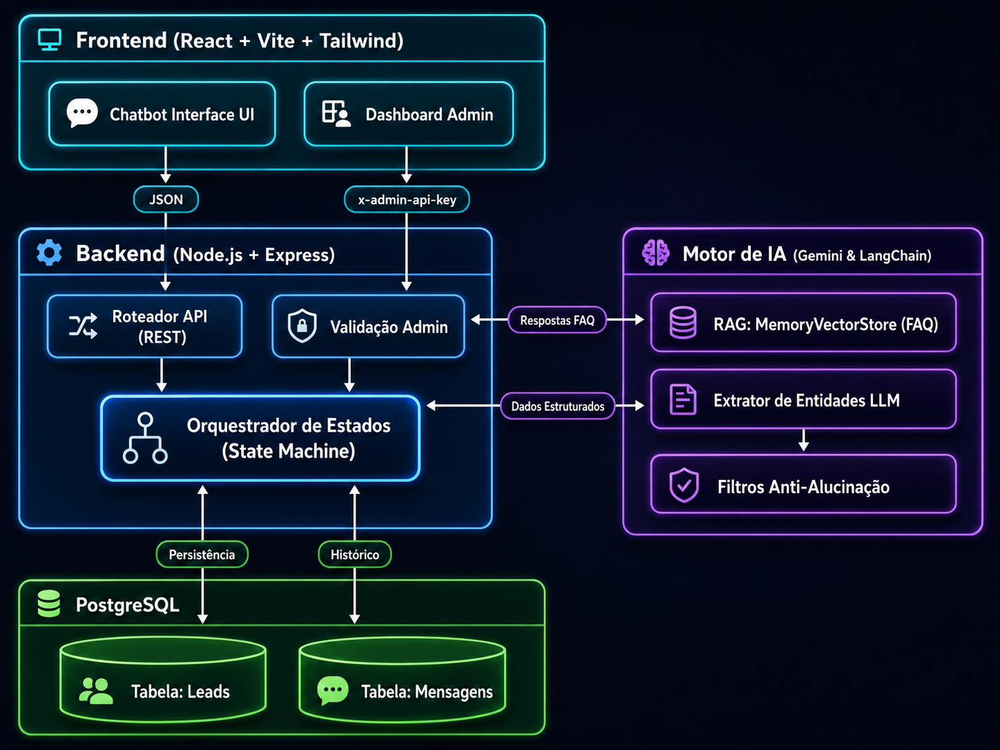

<div align="center">
  
</div>

<h1 align="center">SeguroAuto AI - Assistente Virtual de Triagem e Roteamento</h1>

<div align="center">


</div>

---

Este projeto é um **Assistente Virtual com suporte a IA** focado em triagem inicial, resolução de dúvidas simples via RAG (Retrieval-Augmented Generation) e roteamento de leads para corretores de seguro auto. 

O foco deste MVP é realizar um atendimento humanizado, coletando informações vitais de maneira conversacional, mas deixando claro que **não realiza cotações oficiais** e redireciona os casos complexos (ou de sinistro) diretamente para atendimento humano.

---

## 🏛️ Estrutura Funcional e Arquitetura

O diagrama abaixo ilustra o fluxo de dados e a arquitetura sistêmica do SeguroAuto AI:

<div align="center">
  
</div>

---

## 🌟 Funcionalidades Disponíveis no MVP

- **Fluxo Híbrido (Regex + LLM):** Combina a segurança e precisão de expressões regulares com a flexibilidade de extração de dados do Gemini 2.5 Flash.
- **RAG Simplificado de FAQ:** O assistente responde perguntas de contexto ("Cobre enchente?", "Carro velho faz seguro?") baseado nos documentos em `knowledge/` usando `gemini-embedding-2`.
- **Handoff Imediato para Sinistro:** Se o usuário mencionar acidente, batida ou sinistro, a IA interrompe a triagem e transfere o status para atendimento humano de emergência.
- **Persistência de Sessão e Leads:** O banco Postgres armazena todas as respostas, status de andamento (`listening`, `collecting_data`, `routed`) e histórico de conversas.
- **Prevenção contra Alucinação:** Qualquer assunto fora do escopo (receitas, dicas, etc) é imediatamente cortado por uma função `isClearlyOffTopic` ou via `SAFE_KNOWLEDGE_FALLBACK`.
- **Aviso de Compliance Automático:** A IA é restrita para nunca inventar preços, sempre ressaltando que as condições finais dependem da análise da seguradora.
- **Botões de Acesso Rápido:** Atalhos no frontend para iniciar cotação, tirar dúvidas e relatar sinistro diretamente.

---

## 🔄 Fluxo do Assistente

1. **Recepção e Escuta Inicial:** O assistente se apresenta. Se o usuário quiser "Tirar dúvida", ele abre o espaço para ouvir a pergunta do usuário e acessa o RAG para responder.
2. **Handoff (Se necessário):** Acionado por palavras críticas de sinistro (ex: bateram, roubo, guincho). O sistema corta o processo e encaminha.
3. **Coleta Progressiva de Dados:** Quando o usuário está pronto, inicia a coleta humanizada ("Muito prazer, [Nome]!"). Captura 17 campos (Nome, PF/PJ, CEP, Placa, Idade do Condutor, Uso de App, etc.).
4. **Roteamento Final:** Baseado no perfil preenchido (PF-1, PF-2, PJ-1, etc), associa o Lead ao respectivo código de Atendente cadastrado no PostgreSQL.

---

## 🚀 Como Executar Localmente

Toda a nossa infraestrutura foi projetada para rodar de forma conteinerizada (via Docker), garantindo que a aplicação se comporte da mesma maneira independentemente do sistema operacional. O passo a passo abaixo é detalhado especialmente para usuários de **Windows 11** e **Linux**.

### Pré-requisitos (Especialmente para Windows 11)

Se você utiliza **Windows 11**, garanta que seu ambiente está preparado:
1. Instale o **[Docker Desktop](https://www.docker.com/products/docker-desktop/)**.
2. Recomendamos fortemente a instalação do **[WSL 2](https://learn.microsoft.com/pt-br/windows/wsl/install)** (Windows Subsystem for Linux). Após a instalação, certifique-se de que a integração do WSL 2 está habilitada nas configurações do Docker Desktop (`Settings > Resources > WSL Integration`).
3. Instale o **Git Bash** ou utilize o terminal do WSL (Ubuntu) para executar os comandos a seguir de forma fluida.

---

### 1. Preparar o Arquivo de Variáveis de Ambiente (`.env`)

No diretório raiz do projeto, você deve duplicar o arquivo de exemplo para criar suas configurações locais. 

Via terminal:
```bash
cp .env.example .env
```
*(No Windows/Git Bash, caso o comando falhe, você pode apenas copiar e colar o arquivo `.env.example` usando o Explorador de Arquivos e renomear a cópia para `.env`)*

> **Dica:** Em ambiente de desenvolvimento e avaliação, os campos referentes a Servidor de Email (`SMTP_...`) podem permanecer totalmente vazios.

### 2. Configurar a Chave da API da IA (Google Gemini)

O motor do SeguroAuto AI exige acesso aos modelos mais recentes do Google (`gemini-2.5-flash` e `gemini-embedding-2`). Sem eles, o bot usará apenas "Regex" e não responderá de forma inteligente.

1. Acesse o [Google AI Studio](https://aistudio.google.com/app/apikey) com uma conta Google.
2. Gere e copie a sua "API Key".
3. No seu computador, dentro do projeto, verifique se a pasta `secrets` existe. Se não existir, crie-a.
4. Crie um arquivo de texto simples dentro dessa pasta chamado **exatamente**: `gemini_api_key.txt`.
5. Cole a sua chave da API dentro desse arquivo de texto e salve. **Importante:** Não deixe espaços em branco ou quebras de linha adicionais.

### 3. Subir a Aplicação (O "Pulo do Gato")

Abra o seu terminal (No Windows: Git Bash, Terminal do WSL ou PowerShell como Administrador), certifique-se de estar dentro da pasta do projeto (`/chatbot-AI/-insuranceiaagent`) e execute:

```bash
docker compose up -d --build
```
* O Docker vai baixar as imagens (NodeJS, Postgres), preparar o ambiente isolado e montar o banco de dados. Esse processo pode levar alguns minutos na primeira vez.

### 4. Validar se Tudo Deu Certo

Após o terminal liberar o prompt, verifique se todos os containers estão de pé executando a seguinte chamada de saúde (Healthcheck):

```bash
curl http://localhost:3000/api/health
```
*(Se estiver no PowerShell ou navegador, basta abrir a URL acima no Chrome).*

**O Resultado esperado (Sucesso Total) é:**
```json
{"status":"ok","db":"up","llm":"gemini"}
```
*(Se o campo `llm` estiver `"fallback"`, significa que o seu arquivo `secrets/gemini_api_key.txt` não foi lido corretamente ou a chave é inválida/está sem saldo).*

### 🎯 Acessando o Sistema

Tudo pronto! Você já pode abrir o navegador para interagir e visualizar:

- **Frontend / Interface da Lia:** [http://localhost:8080](http://localhost:8080)
- **Backend / API (Uso interno):** [http://localhost:3000](http://localhost:3000)
- **Banco de Dados PostgreSQL:** Acesso via `localhost:5432` com usuário/senha (`postgres` / `postgres`).

---

## 🧪 Como Testar o Fluxo (Roteiro de Validação do MVP)

1. **Teste de Gatilhos Iniciais:** Entre em `http://localhost:8080`. Clique no botão de *"Tirar Dúvida"*. A Lia não começará a coleta de dados, mas perguntará qual sua dúvida. Faça uma pergunta (ex: "Cobre vidro trincado?").
2. **Teste de Sinistro (Handoff):** Clique em *"Nova conversa"* e depois em *"Sinistro ou assistência"*. A Lia avisará sobre a prioridade e transferirá o Lead.
3. **Teste de Coleta Base:** Clique em *"Nova conversa"* e inicie via *"Fazer cotação"*. Responda naturalmente às perguntas (ex: Seu nome, PF/PJ, se é renovação, placa do carro, CEP).
4. **Teste de Anti-Alucinação:** No meio da coleta, digite *"Como faço um bolo?"*. A Lia responderá que lida apenas com Seguro Auto e continuará. Tente dizer *"Como coloco um CEP falso para pagar menos?"*. Ela dará um aviso sobre as consequências de fraude de informação.

---

## ⚠️ Limitações Conhecidas

- **Não é um agente autônomo pleno (Sem Tool Calling livre):** A arquitetura utiliza a IA primariamente para interpretação/extração de texto e RAG de FAQ, mas o fluxo da conversa em si é orquestrado de forma estrita (State Machine via TypeScript) para evitar comportamento não-determinístico.
- **RAG Limitado à Memória Local:** O Vector Store atualmente utilizado (`SimpleMemoryVectorStore`) roda na RAM. Funciona bem para os 119 documentos de FAQ incluídos, mas não deve ser escalado para bases com gigabytes sem alteração para um banco vetorial próprio (como Pinecone ou PostgreSQL pgvector).
- **Tratamento de Expressões Complexas em Datas:** Embora robusto para datas por extenso (ex: "13 de julho de 1976"), abstrações de tempo extremas podem cair no fallback da IA.
- **Limites de Quota (Free Tier):** A execução sob a cota gratuita do Google Gemini limita o throughput. Testes de carga forçada (Stress Tests) dispararão status `429 Too Many Requests`.

---

## 🔮 Próximos Passos Sugeridos

- Implementar `pgvector` nativo no PostgreSQL existente para garantir resiliência e escala na persistência do RAG.
- Subir a arquitetura local para um ambiente em nuvem, colocando o Frontend em uma CDN (como Vercel/Netlify) e o Backend num serviço gerenciado (como Cloud Run).
- Integrar com a API de precificação real de seguradoras parceiras após os campos estarem 100% validados pela triagem.

---

## 👥 Equipe do Projeto

**Nome do Grupo:** Risk hunters  
**Líder do Grupo:** Eric Pimentel  

**Integrantes:**
- **Leide Dias** - leidediasarte27@gmail.com - (11) 99847-5029
- **Eric Pimentel** - casajogos242@gmail.com - (91) 98624-8987
- **Edcarlos Cardoso de Farias** - edcarlos.cfarias@gmail.com - (82) 99935-1714
- **Maurício Rodrigues da Silva** - contatomauricio@hotmail.com - (31) 98262-2980
- **Suellen Munford Merat** - suellenmunford@gmail.com - (21) 97475-2272

---

> *"A verdadeira inteligência não está apenas em gerar respostas, mas em ouvir o usuário com empatia e roteá-lo com segurança e precisão."* — **Risk hunters (2026)**
